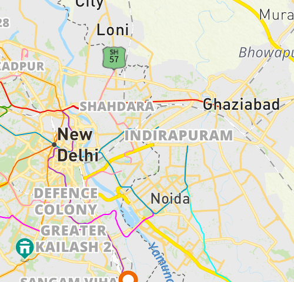

# MapMyIndiaChallenge

## Description
This repository uses map my india APIs to access rad map distance and expected time information from real world traffic scenarios to maximize the profit for a door-to-door vendor in a contrained situtation of limiting maximum travel while to each store having a different profit associated with it. Our work also marks the regions of operations of different vendors so as to prevent resource wastage due to operational region overlap.
